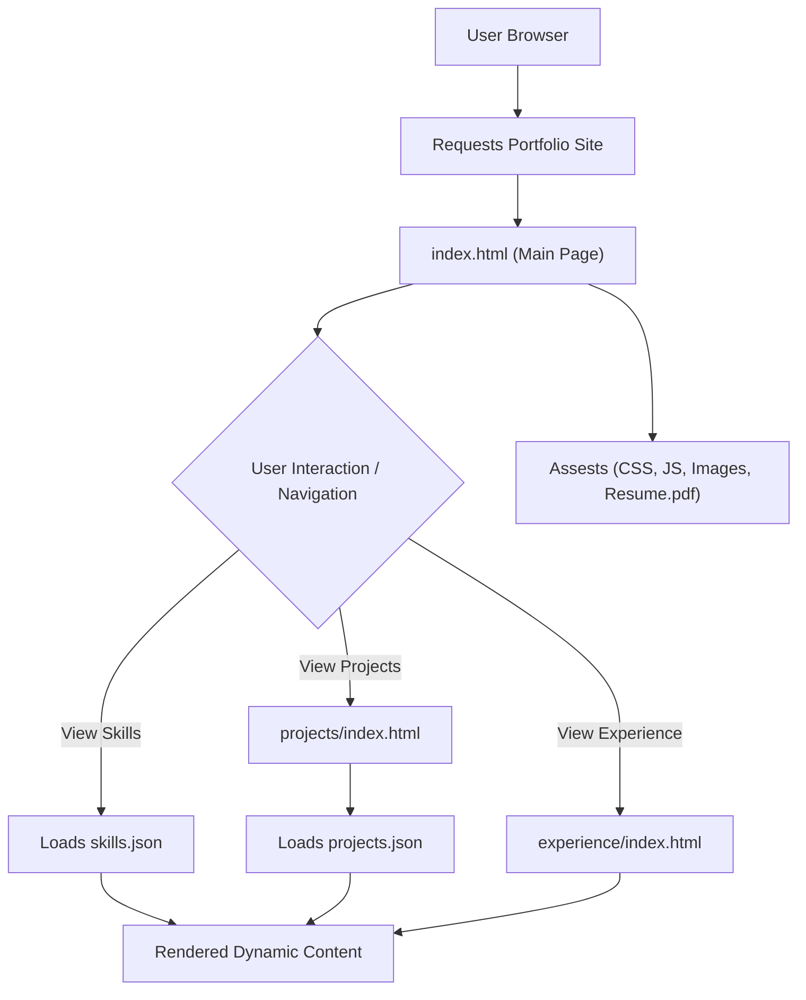

# 🚀 Dynamic Portfolio Website

<p align="center"></p>

## Short Description

This repository hosts a cutting-edge, personal portfolio website designed to dynamically showcase a developer's skills, projects, and professional experience. Crafted with modern web technologies, it offers an engaging and responsive user experience, serving as a comprehensive digital resume for prospective employers, collaborators, and clients.

## ✨ Key Features

*   **Dynamic Content Loading**: Projects and skills are loaded from `projects.json` and `skills.json`, making content updates seamless and efficient without touching the core HTML structure.
*   **Dedicated Sections**: Separate, richly designed pages for a detailed overview of `projects` and `experience`, ensuring clear navigation and focused content presentation.
*   **Interactive User Interface**: Leveraging JavaScript for animations and interactivity, including `particles.min.js` for visually appealing background effects, to create a memorable browsing experience.
*   **Responsive Design**: Built with modern CSS (`style.css`) to ensure a flawless and adaptive display across all devices, from desktops to mobile phones.
*   **Automated Deployment**: Integrated GitHub Actions (`ci-cd.yml`) streamline the deployment process, ensuring that every update is automatically built and published.
*   **Integrated Resume**: A directly accessible `resume.pdf` allows for quick review of professional qualifications.
*   **Custom 404 Page**: A unique `404.html` with dedicated styling (`404.css`) and scripting (`404.js`) enhances user experience even when navigating to non-existent pages.

## Who is this for?

This project is ideal for:
*   **Software Developers & Engineers** seeking a professional and interactive platform to showcase their work and expertise.
*   **Job Seekers** who want to impress recruiters and hiring managers with a detailed and engaging online presence.
*   **Freelancers and Consultants** looking to present their portfolio to potential clients effectively.
*   Anyone interested in a clean, modern, and dynamic template for their personal branding website.

## Technology Stack & Architecture

This portfolio is built on a robust and widely accessible stack:

*   **Frontend**:
    *   **HTML5**: For structuring the content.
    *   **CSS3**: Styled with `style.css` and dedicated stylesheets for responsiveness and visual appeal.
    *   **JavaScript**: Powers the interactive elements, dynamic content loading, and visual effects (e.g., `particles.min.js`).
*   **Build & Deployment**:
    *   **GitHub Actions**: Implements Continuous Integration/Continuous Deployment (CI/CD) for automated testing and deployment of the static site.

This architecture results in a fast, secure, and easily maintainable static website, ideal for high availability and low operational overhead.

## 📊 Architecture & Database Schema

The portfolio operates as a static site, delivering content directly to the user's browser. Its architecture focuses on efficient content delivery and a smooth user experience.



## ⚡ Quick Start Guide

Getting this portfolio up and running on your local machine is straightforward:

1.  **Clone the Repository**:
    ```bash
    git clone https://github.com/Yashwanth-H-M/portfolio_website.git
    cd portfolio_website
    ```

2.  **Open in Browser**:
    Simply open the `index.html` file in your preferred web browser.
    ```bash
    # For Linux/macOS
    open index.html
    # For Windows
    start index.html
    ```
    This will launch the portfolio website locally, allowing you to explore its features and content. For live deployment, the integrated GitHub Actions (`.github/workflows/ci-cd.yml`) automate the process to a static hosting service.

## 📜 License

This project is licensed under the terms found in the `LICENSE` file.